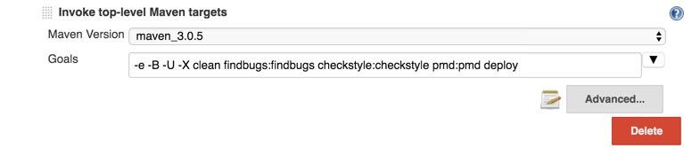
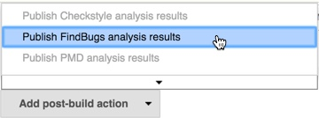
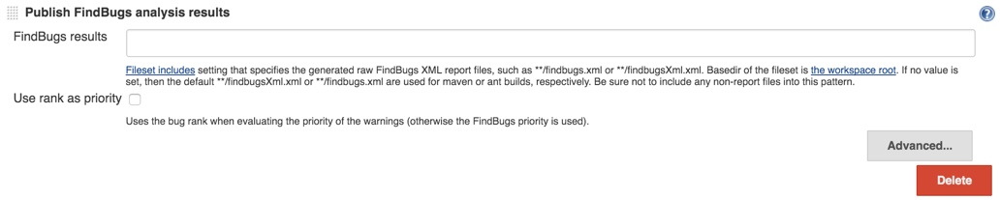
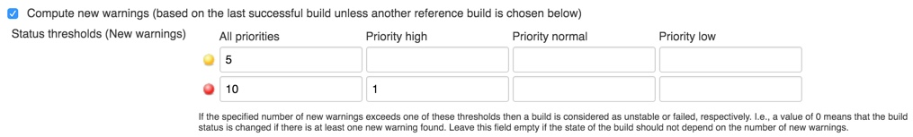

One of the easiest ways to improve code quality is to implement automated static code analysis to inspect your code and automatically identify potential problems. Static code analysis can identify violation of coding standards, inefficient code and possible coding errors without having to write any tests.  Utilizing these tools during the software development process will allow potential defects to be identified and fixed early with minimal effort and cost and should be part of the quality process.

# Why Use Static Code Analysis?

So, what is [Static Code Analysis][wiki-page]? It doesn't have anything to do with `static` code or variable declarations. Static Code Analysis refers to the automated analysis of computer code without actually executing the code. This is accomplished by looking at the source code and, in some cases, object code.

> [Never send a human to do a machine’s job.](http://quotegeek.com/quotes-from-movies/the-matrix/1284/)
> -- <cite>Agent Smith, The Matrix</cite>

I agree with Agent Smith that machine's are much better suited to some tasks than humans are.  These tools can search through every line of code looking for patterns that indicate a possible issue.  It is impossible to have the same degree of thoroughness without the automation of these tools. That said, static code analysis is not a replacement for code review by a human, but it should be used as a first-pass to find certain categories of issues prior to code review. It is also not a replacement for unit or functional testing. It can, however, improve the overall quality of your code by automatically identifying issues that have rather straight-forward fixes and help guide developers to follow coding best practices.

This article will explain the tools and how to go through the maturity levels:

1. Use tools in IDE
2. Configure tools in Maven build
3. Report in Jenkins
4. Enforce in Jenkins
5. Enforce in pre-commit check

# Tools for Static Code Analysis
There are a number of tools available to analyze Java code.  In this post I will focus on three open-source tools: [Checkstyle][checkstyle-url], [FindBugs][findbugs-url] and [PMD][pmd-url]. I feel that the combination of these three tools addresses the needs of the majority of software development projects. However, there are also a number of good commercial tools available as well that you may consider, particularly if you have a large codebase (and large budget).

## [Checkstyle][checkstyle-url]
As the name implies, Checkstyle focused on insuring that Java code adheres to a particular coding standard as defined by a set of rules. There are default rules for [Sun Code Conventions][sun-codeconv] and [Google Java Style][goog-codeconv] and you can also customize the rules to match your organizations coding standards.

Most issues that Checkstyle reports are not really functional issues, but represent violations of generally accepted best practices and coding conventions.  When other maintainers take up the code, violations such as these _can_ lead to functional issues down the line due to the fact that the code may be hard to understand or is overly complex.

### Example Violations
The following code will be flagged with the following ruleset violations:

* 'if' is not followed by whitespace.
* '+' is not preceded with whitespace.
* 'if' is not followed by whitespace.

```java
if(LOGGER.isDebugEnabled()) {
	LOGGER.debug("The value of "+key+" is "+value);
}
```

After the violations are corrected the code looks like this:

```java
if (LOGGER.isDebugEnabled()) {
	LOGGER.debug("The value of " + key + " is " + value);
}
```

Perhaps not a big deal, but the code is certainly more readable.  The [full list of rules for Checkstyle][checkstyle-rules] contains many more patterns that can be added or removed from your customized ruleset (or you can just use the default [sun_checks.xml][sun-checks] or [google_checks.xml][google-checks]).

## [FindBugs][findbugs-url]
Again, as the name implies, FindBugs attempts to find software defects in Java code. It looks for a number of known bug patterns and reports those as violations. It's possible that some of the violations reported are "false negatives" so you will have to examine and analyze the code to see if the issue should be fixed.

### Example Violations
Consider the following code. It is flagged with the following ruleset violation:

* Return value of String.replace(char, char) ignored

```java
String str = "bob";
str.replace('b', 'p');
assertEquals(str, "pop");
```

The above code compiles successfully and a casual code-review may miss that the intent was really the following:

```java
String str = "bob";
String newStr = str.replace('b', 'p');
assertEquals(newStr, "pop");
```

## [PMD][pmd-url]
Nobody is quite sure [what PMD stands for][pmdmeaning-url], but, similar to FindBugs, it looks for common programming flaws in Java code.  But notice the operative word '_flaw_' instead of '_bug_'. PMD casts a slightly wider net and looks for things such as 'unused variables, empty catch blocks, unnecessary object creation, and so forth.' The end result is PMD will find things that Checkstyle and FindBugs do not (although there is some overlap with FindBugs). Also, PMD supports multiple languages, not just Java. For clean, quality code most issues reported by PMD should be fixed, although "false negatives" are also possible.

### Example Violations

Consider the following code. PMD would report the violation `UnusedFormalParameter`.

```java
private int getProduct(int foo, int bar) {
	return foo * bar;
}
private int getSquare(int foo, int bar) {
	return foo * foo;
}
private int getSum(int foo, int bar) {
	return foo;
}
```

Perhaps the above code was a result of a copy-paste error.  The correct code should be:

```java
private int getProduct(int foo, int bar) {
	return foo * bar;
}
private int getSquare(int foo) {
	return foo * foo;
}
private int getSum(int foo, int bar) {
	return foo + bar;
}
```

If we assume the above private methods were not referenced in the class, PMD would also report the violation `UnusedPrivateMethod`.  Since that would mean these methods are 'dead code' perhaps they should be removed.

## Commercial Tools
There are also a number of commercial static-analysis tools. In some cases they find more and different issues than the open source tools, particularly security related issues, but they are pricey. In addition most offer an integrated system to track each violation or vulnerability and can track the workflow through resolution of each issue which is very useful with a large codebase. They also may support additional languages beyond just Java.

* [Coverity][coverity-url]
* [Fortify][fortify-url] - Mostly security related checks.
* [CheckMarx][checkmarx-url] - Mostly security related checks.

The next section will discuss how to begin using Checkstyle, FindBugs and PMD in your IDE.

# Use Tools in IDE
The most immediate way to benefit from static code analysis tools is to use those tools directly in your IDE.  In a way, a compiler is the most basic of such tools.  The compiler analyzes the code and will give you the specific line of code that cause the compilation error. Static code analysis tools take this further and compares your code to a set of predefined (and customizable) rules and reports different types of 'rule violations'.

Most IDEs offer a plugin architecture that allow additional tools to be added. By running these tools in your IDE you can find and fix issues as you write the code.

Some IDEs may find some of the issues discovered by these tools using their in-built checks, but generally these tools are complementary to functionality offered by IDEs. Also, as we will see later in this article, these tools can be run as part of your Maven build, independent of a particular IDE, offering advantages.

## Eclipse Plugins
The following Eclipse plug-ins for static code analysis are easily installable via the usual 'install new software' functionality. Most of these plugins will require a restart of Eclipse to go into effect, so just install all the plugins first, and restart Eclipse after the last install.

* [Checkstyle Plugin](http://eclipse-cs.sf.net/update/)
* [FindBugs Plugin](http://findbugs.cs.umd.edu/eclipse/)
* [PMD Plug-in](http://sourceforge.net/projects/pmd/files/pmd-eclipse/update-site/)

## IntelliJ Plugins
I don't use IntelliJ, but here are some links to IntelliJ plugins:

* [CheckStyle-IDEA Plugin](https://plugins.jetbrains.com/plugin/1065)
* [FindBugs-IDEA Plugin](https://plugins.jetbrains.com/plugin/3847)

## NetBeans Plugins
I don't use NetBeans either, but here are come links to NetBeans plugins:

* [Checkstyle Beans](http://plugins.netbeans.org/plugin/3413/checkstyle-beans)
* [FindBugs Plugin](http://plugins.netbeans.org/plugin/912/findbugs-tm-plugin)
* [EasyPmd](http://plugins.netbeans.org/plugin/57270/easypmd)

Make sure that the IDE plugins for these tools are using the same rulesets (or superset of rulesets) as are used in the Maven configuration.  Otherwise your IDE plugin may not report issues (or may report additional issues) compared to your Maven build and Jenkins job. 

Other IDEs will also likely offer plugins for Checkstyle, FindBugs and PMD.  Even if you use a bare-bones text editor you can still use these tools as part of your normal development process by integrating them into your build process (e.g. Maven, Ant or Gradle).

The following section will describe how to integrate these tools into your Maven build.

# Configure Tools in Maven Build

The following plugins are available for Maven:

* [Checkstyle](https://maven.apache.org/plugins/maven-checkstyle-plugin/)
* [FindBugs](http://gleclaire.github.io/findbugs-maven-plugin/)
* [PMD](https://maven.apache.org/plugins/maven-pmd-plugin/)

## Add plugin configuration to your parent POM

Here is what is needed to be added to your parent POM:

```xml
	<properties>
		<checkstyle.version>2.17</checkstyle.version>
		<findbugs.version>3.0.3</findbugs.version>
		<pmd.version>3.6</pmd.version>
	</properties>
	<build>
		<pluginManagement>
			<plugins>
				<plugin>
					<groupId>org.apache.maven.plugins</groupId>
					<artifactId>maven-checkstyle-plugin</artifactId>
					<version>${checkstyle.version}</version>
					<executions>
						<execution>
							<id>checkstyle</id>
							<goals>
								<goal>checkstyle</goal>
							</goals>
							<phase>verify</phase>
						</execution>
					</executions>
				</plugin>
				<plugin>
					<groupId>org.codehaus.mojo</groupId>
					<artifactId>findbugs-maven-plugin</artifactId>
					<version>${findbugs.version}</version>
					<executions>
						<execution>
							<id>findbugs</id>
							<goals>
								<goal>findbugs</goal>
							</goals>
							<phase>verify</phase>
						</execution>
					</executions>
				</plugin>
				<plugin>
					<groupId>org.apache.maven.plugins</groupId>
					<artifactId>maven-pmd-plugin</artifactId>
					<version>${pmd.version}</version>
					<executions>
						<execution>
							<id>pmd</id>
							<goals>
								<goal>pmd</goal>
							</goals>
							<phase>verify</phase>
						</execution>
					</executions>
				</plugin>
			</plugins>
		</pluginManagement>
	</build>
```

If for some reason you do not want the tools to run on every build (e.g. you have a very large codebase and the tools slow down the build) you can omit the `<executions>` section from the POM. In that case you will need to specify the tools goals explicitly when running the maven build.

```shell
mvn clean checkstyle:checkstyle findbugs:findbugs pmd:pmd install
```


Refer to the documentation for each Maven plugin for more information on additional configuration options available.

## Add plugin declaration in your child POMs

Once the configuration of the plugs is declared in `pluginManagement`, the plugins just need to be added to the build of each child pom as desired.

```xml
	<build>
		<plugins>
			<plugin>
				<groupId>org.apache.maven.plugins</groupId>
				<artifactId>maven-checkstyle-plugin</artifactId>
			</plugin>
			<plugin>
				<groupId>org.codehaus.mojo</groupId>
				<artifactId>findbugs-maven-plugin</artifactId>
			</plugin>
			<plugin>
				<groupId>org.apache.maven.plugins</groupId>
				<artifactId>maven-pmd-plugin</artifactId>
			</plugin>
		</plugins>
	</build>
```

# Report in Jenkins

Now that the tools are run as a normal part of your Maven build it is very easy to report the results of Checkstyle, FindBugs and PMD as part of the 'commit build' Jenkins job.

The goal is to resolve all the 'High Priority' FindBugs warnings and, overtime, reduce the number of 'Normal Priority' FindBug warnings and the warnings from other tools.

Jenkins plugins are required for reporting the results of each tool in the Jenkins job.

* [Checkstyle Jenkins Plugin](https://wiki.jenkins-ci.org/display/JENKINS/Checkstyle+Plugin)
* [FindBugs Jenkins Plugin](https://wiki.jenkins-ci.org/display/JENKINS/FindBugs+Plugin)
* [PMD Jenkins Plugin](https://wiki.jenkins-ci.org/display/JENKINS/PMD+Plugin)

## Run maven goals in Jenkins job

If you already have a Jenkins commit job and you included the tools in the tools in the verify execution phase then you shouldn't need to do anything additional to have to do anything additional.  Just make sure that the expected result files are generated.

But to be sure, you can list the tools goals explicitly on the Maven command like the following:



## Publish Analysis Results in Jenkins Job

To publish the results of the tools you add a post-build step for each tool reporter.  Note that you need to install the appropriate Jenkins plugin before these options are available.





# Enforce in Jenkins

Once the results are published as part of the Jenkins job, the reporters can be configured to mark the build as unstable or failed if the number of violations exceeds a certain threshold. Or a previous build can be used as a reference point so the build will be marked unstable or failed if any new warnings are reported.

The configuration of all the result publishers are similar.  The below screenshot show the FindBugs publisher advanced configuration for Status Thresholds that will mark the build as failed for one high priority violation or unstable for five and failed for ten violations of any priority.


The below screenshots shows the advanced configuration that will mark the build as failed for one _new_ high priority violation or unstable for five and failed for ten _new_ violations of any priority, using the last stable build as a reference.  This type of configuration let's you "grandfather" existing violations, only changing the build state for new violations.



# Enforce in Pre-commit Checks

Eing Ong has written a blog on adding enforcement of thresholds to [pre-commit checks using GitHub webhooks](http://eing.github.io/technology/2016/02/29/Git-Pre-Commit-Hooks-Part2/).

# Next Steps

## Other Non-Java Tools

JSHint Plug-in - http://github.eclipsesource.com/jshint-eclipse/updates/
JSHint/JSLint

<!-- Link references -->
[wiki-page]: https://en.wikipedia.org/wiki/Static_program_analysis
[checkstyle-url]: http://checkstyle.sourceforge.net/
[checkstyle-rules]: http://checkstyle.sourceforge.net/checks.html
[sun-checks]: https://github.com/checkstyle/checkstyle/blob/master/src/main/resources/sun_checks.xml
[google-checks]: https://github.com/checkstyle/checkstyle/blob/master/src/main/resources/google_checks.xml
[findbugs-url]: http://findbugs.sourceforge.net/
[pmd-url]: https://pmd.github.io/
[pmdmeaning-url]: http://pmd.sourceforge.net/pmd-5.0.4/meaning.html
[coverity-url]: http://www.coverity.com/
[fortify-url]: http://www.ndm.net/hpsoftware/Security/hp-fortify-software-security-center
[checkmarx-url]: https://www.checkmarx.com/
[sun-codeconv]: http://www.oracle.com/technetwork/java/codeconventions-150003.pdf
[goog-codeconv]: http://checkstyle.sourceforge.net/reports/google-java-style.html